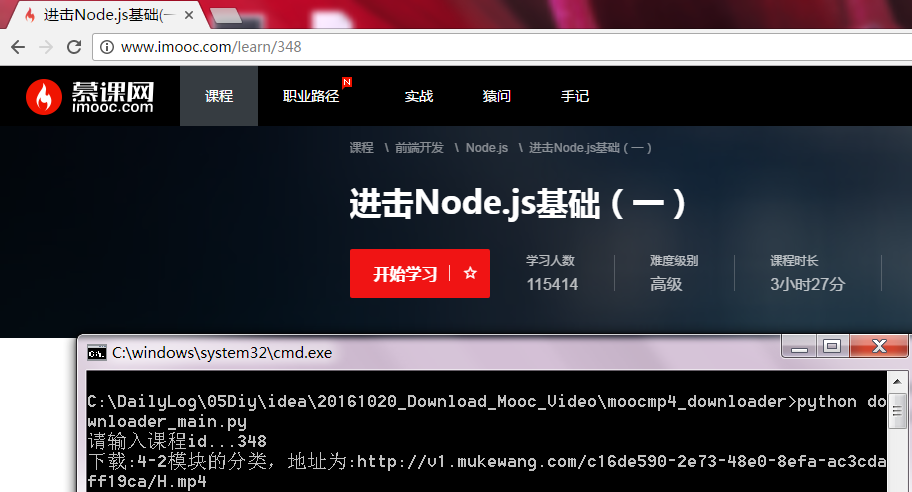
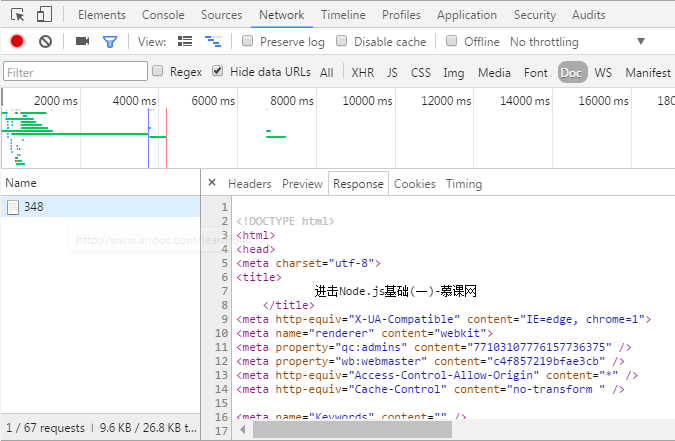
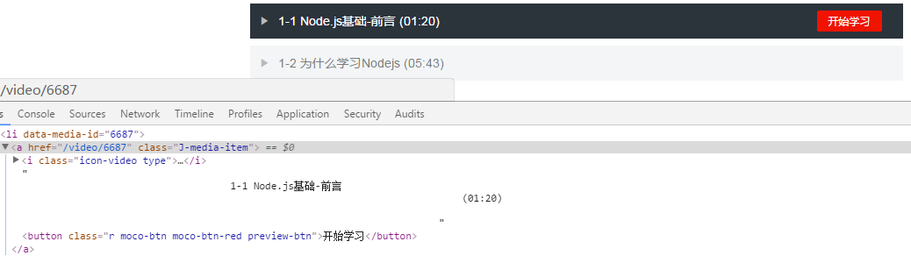
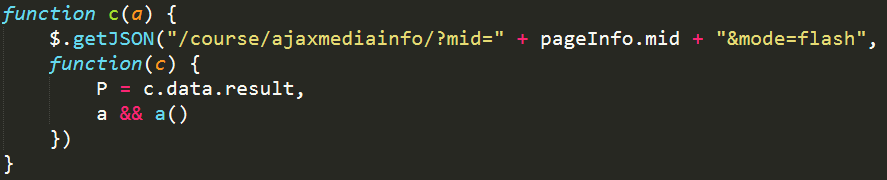
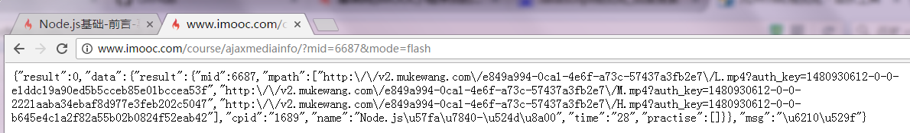

## （写在前）写给谁？
1. 拥有“神奇的网络”的人。（在线观看速度慢，下载速度快的网络。）
2. 一遍看不懂还要看很多遍的小伙伴。（慕课网没有提供下载功能,所以自己写一个）
3. 学完爬虫要学以致用的小朋友。

## （一）How to use
1. 下载安装 beautifulsoup
2. 运行 start.bat
3. 输入 课程id
4. 课程会保存在程序运行目录下以项目名命名的文件夹中

## （二）How to write
###1. 项目结构
* downloader_main：程序主逻辑
* downloader：发送http请求获得响应和下载视频
* html_parser：解析html字符串
* url_manager：管理url
* html_output：格式化输出为html（未完待续...）

###2. 安装 python3.5.2 +BeautifuSoup

###3. follow me :）

1. 输入课程id获得课程url，

		root_url = 'http://www.imooc.com/learn/' + course_num

2. 下载课程url对应的html字符串
	1. 模拟浏览器发送请求并返回响应（即浏览器response的内容）  
	  
	这里封装一个_get_response(url)函数：
	
			def _get_response(self,url):
				req = request.Request(url)
			    # 模拟火狐浏览器
			    req.add_header('User-Agent', 'Mozilla/5.0 (Windows NT 6.1; WOW64; rv:48.0) Gecko/20100101 Firefox/48.0')
			    response = request.urlopen(req)
			    if response.status != 200:
			        return None
			    return response.read().decode('utf-8')

	2. 调用_get_response函数,传入课程url,返回html字符串让解析器解析
		
			def download_html(self,url):
	        	return self._get_response(url)

			download_html(root_url)

3. 解析html内容，得到url列表

		from bs4 import BeautifulSoup
		# 解析课程html，返回视频的url列表以及url为key，name为value组成的dict以及课程的名字
		def parse(self,html_cont):
			# 得到树形结构的文档对象（传入指定html字符串，解析器以）
		    soup = BeautifulSoup(html_cont, 'html.parser')
		    mp4,urls=self._get_urls(soup)
		    course_name=self._get_course_name(soup)
		    return mp4,urls,course_name	
	
	其中，_get_urls()方法主要包含以下内容：
	1. 获得视频id和text内容，分别用于获得视频url和视频name
	

			selector=soup.find_all('a','J-media-item')
			total=len(selector)
			for s in selector:
	            # 获取视频id "/video/6687" -->6687
	            href=s['href']
	            mp4_id=str.replace(href,"/video/",'')
	            # 获取text内容
	            text=s.get_text()	

	2. 过滤非视频（以text是否有时间为标准）
			
			time_pattern=re.compile('\(\d{2}:\d{2}\)')
            if(not re.search(time_pattern,text)):
                total=total-1
                if(total==0 ):
					# 没有视频下载时给出提示信息并退出程序
                    exit("没有视频可以下载！")
            else:
				#这里写“是视频”的逻辑

	3. 获得视频name
	
			# 去掉时间，去掉空格，去掉'开始学习'，只留视频名称
            tmp1=re.sub(time_pattern,'',text)
            space_pattern=re.compile('\s*')
            tmp2 = re.sub(space_pattern, '', tmp1)
            mp4_name = re.sub('开始学习', '', tmp2)

	4. 获得视频url
		1. 找到由视频id获得视频url的请求地址
			1. 如登陆后会加载一个video.js文件，该文件向服务器发起请求获取视频url，异步加载视频资源。
			2. 格式化该文件代码，可以看到它的请求如下：
			
		

		2. 我们构造然后发送这个请求并获得响应

				url = 'http://www.imooc.com/course/ajaxmediainfo/?mid='+id+'&mode=flash'
				res=self._get_response(url)

		3. 解析json格式的resonse数据得到高清视频对应的url
		
		
				import json
				# json.load载入后为dict数据
		        dict_data = json.loads(res)
		        # 返回高清视频对应的url
		        return dict_data['data']['result']['mpath'][2]

		4. url从v2版到v1版，封装为如下函数：

			    def _v2_to_v1(self,url):
			        # http://v2.mukewang.com/e849a994-0ca1-4e6f-a73c-57437a3fb2e7/H.mp4?auth_key=1479972233-0-0-9248ccde9e7471bb5bb19a1196cc71e8
			        # http://v1.mukewang.com/e849a994-0ca1-4e6f-a73c-57437a3fb2e7/H.mp4?
			        tmp = re.split('\?', url)[0]
			        return re.sub('v2','v1',tmp)
		
4. 下载url对应的视频
	1. 指定保存目录

			# 获得当前目录
	        current_dir = os.getcwd()
	        # 当前工作目录下新建课程目录
	        course_dir = os.path.join(current_dir, course_name)
	        if (not os.path.exists(course_dir)):
	            os.mkdir(course_dir)
	        # 创建视频保存地址
	        addr= os.path.join(course_dir, name+ '.mp4')

	2. 下载url对应的视频 
	 
			request.urlretrieve(url, addr,_cb)

	3. 对url的管理与断点续传（下载失败处理）
			
			# url非空,执行以下循环
        	while self.urls.has_url():
	            # 获取新的url
	            url = self.urls.get_url()
	            # 输出待爬取的url
	            print('下载:%s，地址为:%s' % (mp4_lists[url],url))
	            try:
	                # 下载url对应的视频
	                self.downloader.download_mp4(url,mp4_lists[url],course_name)
	            except:
	                print('%s下载失败，重新下载'% mp4_lists[url])
	                self.urls.add_url(url)
			
		* url使用set存储，确保唯一  
		* 使用url为key，name为value的dict,将视频url和name联系起来  
		* 使用try except实现下载失败后重新下载

5. supplements
	1. 计时  
			
			from datetime import datetime
	        start = datetime.now()
			print('共用时：', (datetime.now() - start + datetime(1970, 1, 1)).strftime('%H:%M:%S'))

	2. 显示下载进度
	
			def _cb(self,blocknum, blocksize, totalsize):
		        percent = 100.0 * blocknum * blocksize / totalsize
		        if percent > 100:
		            percent = 100
		        # 格式化输出下载进度,不需要换行
		        sys.stdout.write("'[%.2f%%]  \r" % (percent))
		        # 让下载百分比再同一行不断刷新
		        sys.stdout.flush()

	3. 使用sys.path.append(path)添加相关的路径
	
			# 添加当前（项目）目录到path
			import sys
			import os
			sys.path.append(os.path.split(os.getcwd())[0])
	4. 代理 （cn-proxy）
	
			# 慕课网爬虫项目并没有用到
			proxy_list = [
			    'http://111.23.4.155:8080',
			    'http://120.92.3.165:80',
			    'http://120.25.235.11:8089',
			]
			proxy_ip = random.choice(proxy_list)
			proxies = {'http': proxy_ip}

	5. 多进程，同时下载多个课程（多进程或单进程+显示下载进度，我选择了后者）

			# 得到课程编号
		    # courses = input('请输入课程id，多个id用空格隔开').split()
		    # 创建进程池
		    # p = Pool()
		    # 实例化下载器,下载指定课程
		    # p.map(Downloader_Main().download, courses)

			